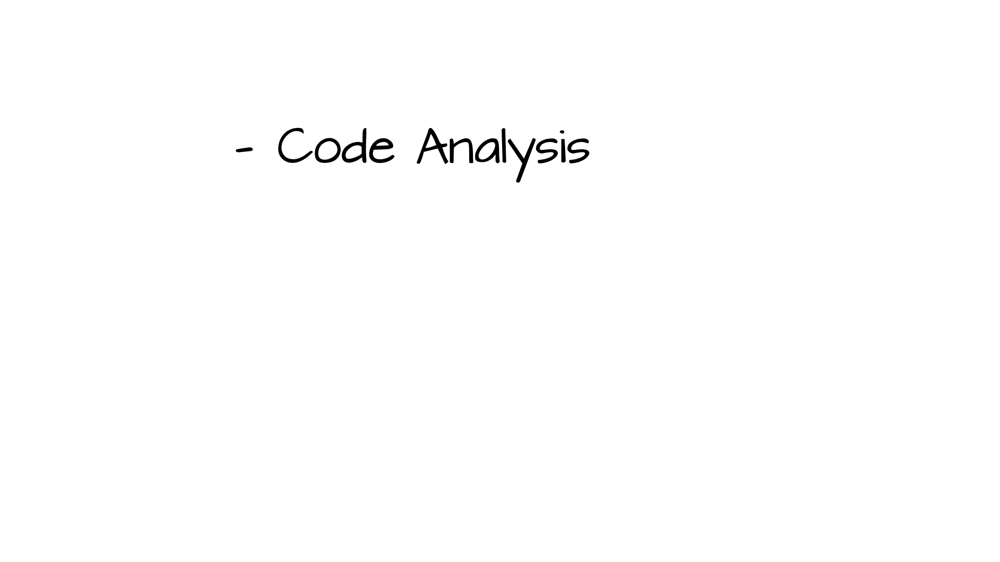
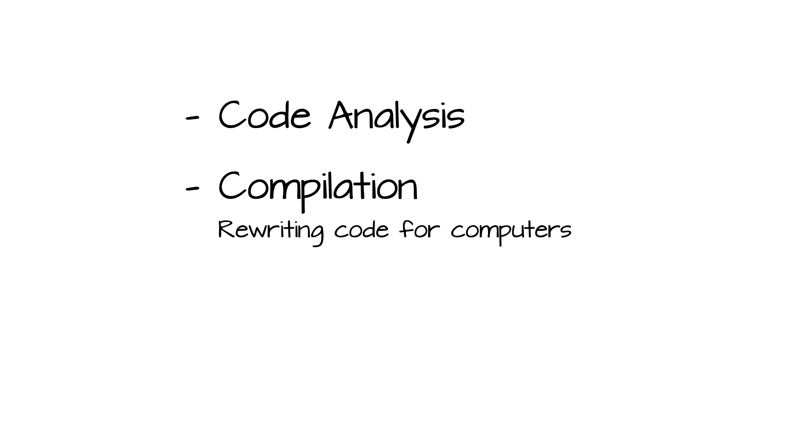
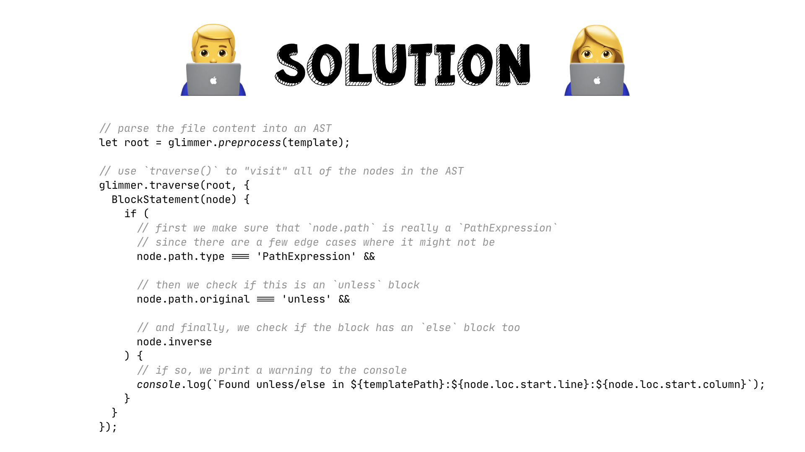
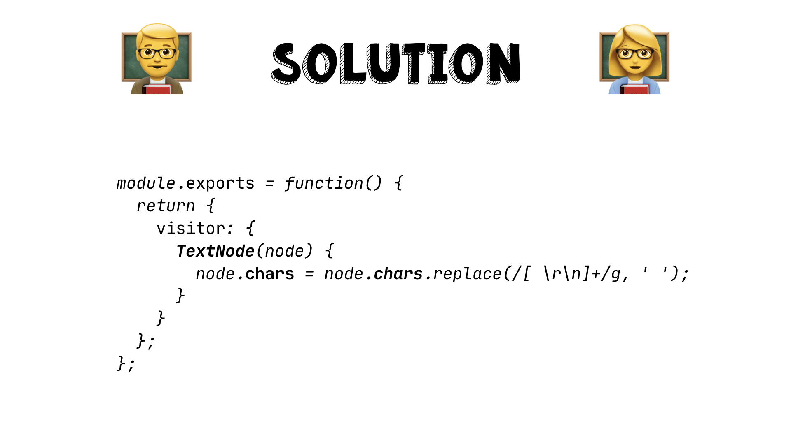
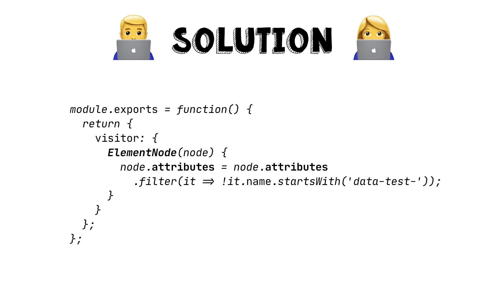

# Abstract Syntax Forestry

An EmberConf 2020 workshop from [simplabs](https://simplabs.com/) to teach you
the basics about Abstract Syntax Trees.


## 

Hello everyone and welcome to this workshop which I titled "Abstract Syntax
Forestry".

Since probably not everyone doing this workshop is a native speaker and
immediately understands this word play, let's quickly start with an intro
about what that title means.


## 

First of all, what does "Forestry" mean?

Any idea?

According to [Wikipedia](https://en.wikipedia.org/wiki/Forestry):

> **Forestry** is the science and craft of creating, managing, using,
conserving, and repairing forests, woodlands, and associated resources for human
and environmental benefits.

or in other words:


## 

**Forestry** means: working with trees!


## 

now... what is a **tree**?


## 

This is a **tree**!

But it's not the kind of tree we want to talk about in this workshop... 


## 

There is a certain type of data structure that is also called **tree**, because
depending on how you look at it, it roughly looks like a real tree. And some
other terminology (aka. words) also are borrowed from this metaphor. The
**tree** data structure has **leaf** elements, it has **branches** and it has a
**root** elements.

About that... what defines a **tree** data structure?


## 

First of all, a **tree** is a **graph** data structure, but a specific kind of
graph. The defining features are that a tree has exactly **one root element**
(at the top here), and that element can have 0, 1, 2, 1000, or even more, child
elements. And then each of those child elements can also have an arbitrary
number of child elements.

But, a child element can only ever have one parent element!

If you need something else to compare against: it is very roughly like a
recursive `belongsTo` relationship in Ember Data or any other relational
database/ORM kind of system.

Now that we have a rough understanding of what a **tree** is in theory, let's
get into a few real examples of where the **tree** data structure is being used.

Any ideas?

(yes, I realize that in this format you've likely already had a glimpse of the
next slide 😅)


## 

One example of a **tree** structure that we use all the time is: JSON.

JSON has a very limited number of data types and arrays and objects are the
only ones that can have children. An array can have 0, 1, 1000, or more
elements in it. And an object can also have 0, 1, 1000, or more keys with
their associated values in it.

And then there is the constraint of having a single root element. If you look
at a JSON file, you can see that it always either has a single object or array
as the main element in the file, and if you try to put a second thing in the
file it will result in a syntax error.

That means, similar to how trees are a specific kind of **graph** data
structure, we can consider JSON to be a specific kind of **tree** data
structure.


## 

Another real-world example is HTML. In HTML you have the root `<html>` element,
and that can have multiple children, though in reality it only supports `<head>`
and `<body>`. But those then can also have an arbitrary number of child
elements.


## 

You can see on the right side of the above slide how the tree structure of
the HTML file on the left side could be represented.

If you feel reminded of the DOM (document object model) in the browser, that is
no coincidence. The browser also parses the HTML file into such a tree
structure and then exposes it to JavaScript as the DOM.


## 

So far we've only been talking about **trees**. But what about the other two
words in that workshop title? what does "abstract syntax" mean?


## 

In a very basic way, an "Abstract Syntax Tree" is a JSON object that
represents the code structure of a file.

As you can see in the slide, I've put asterisks (`*`) on the words "JSON" and
"code", because...


## 

While most parsers in the JavaScript ecosystem produce JSON-based ASTs, there
are quite a few parsers in other ecosystems that don't use JSON. Since this
workshop assumes that most of you are working primarily with JavaScript we will
focus on JSON-based ASTs here for now.

Please note that the general concept will still be roughly the same, whether
the parser produces JSON, or not.


## 

The other asterisk was on "code". Because while ASTs are mostly used for code
there are also some other file parsers that can produce ASTs.

Take our earlier example of HTML. HTML is a subset of XML, and XML can be used
for regular data files. But a lot of HTML parsers that produce ASTs can handle
XML, so you can easily convert an XML data file into an AST.

But enough of all this theoretical talk, let's look at an example!


## 

There is a great tool on the internet that I would like to introduce you to,
and it's called **AST Explorer**.

You can find it at <https://astexplorer.net>.

If you've never opened it before it will start you on the default view,
with an example JavaScript file on the left side, and the corresponding
syntax tree on the right side.

You can notice that when you click on something in the left panel it will
automatically focus the corresponding syntax tree element in the right panel,
and similarly, if you hover over something in the right panel it highlights
the corresponding characters on the left. (if it does not do that, check if you
have the "Autofocus" checkbox enabled on the right side of the screen)

Where it gets interesting is when you move your cursor over the "JavaScript"
button in the menu bar at the top. Here, you should see a dropdown menu of all
the available languages that the AST Explorer understands. If you look closely,
you can see that it also supports **Handlebars**, which is what we will be
focusing on for this first bit of the workshop.

If you click on "Handlebars" you will see that the snippet in the left panel
has changed to a small example template, and the right panel is now also
showing something different: the Handlebars syntax tree.

In case you're wondering "where is the JSON that we talked about?", have a look
at the "Tree | JSON" tab bar on the right side of the screen. If you click on
"JSON" you can see the raw JSON data, while the "Tree" view shows a slightly
more ergonomic view of the same data.


## 

Let's start with the first exercise!

I invite you to click around a bit in the AST Explorer and when you feel
comfortable try to answer the three questions above.

If you don't know what an **element modifier** is I would recommend to first
have a look at the [Ember.js Guides](https://guides.emberjs.com/release/components/template-lifecycle-dom-and-modifiers/)
that explain what they are and what they can be used for.

To get started you can modify the example template on the left side of the
screen to match the snippet below:

```hbs
<div class="entry">
  <h1>{{title}}</h1>
  <div class="body">
    {{body}}
  </div>
  <button type="button" {{on "click" this.onNext}}>Next</button>
</div>
```

<details>
 <summary>Solution 1</summary>

> what is the node type of and element modifier in handlebars templates?

To solve this first exercise we need to click on the `on` in 
`{{on "click" this.onNext}}`, which will focus a `PathExpression` element in the
AST. You can see that this `PathExpression` belongs to the `path` attribute of
the parent element and that element has the `type` attribute
`ElementModifierStatement`

And that is already the answer to our first question "what is the node type of
and element modifier in handlebars templates?":

The node `type` of an element modifier is `ElementModifierStatement`
</details>

<details>
 <summary>Solution 2</summary>

> what other attributes does a modifier have?

For this question we keep our focus on the `ElementModifierStatement` node in
the AST. We've already seen that the element has a `type`
(`ElementModifierStatement`) and a `path` (a `PathExpression` with `on`), but
there are also some other attributes here:

- `params` holds a list of all the positional parameters (`"click"` and
  `this.onNext` in this case).

- `hash` holds information about named parameters. for example the [`on`
  modifier](https://api.emberjs.com/ember/3.17/classes/Ember.Templates.helpers/methods/on?anchor=on)
  that we're using in this example supports a named parameter called `passive`,
  that can be used like this: `{{on "click" this.onNext passive=true}}`

Depending on the state of the "Hide location data" checkbox in the AST Explorer
you can also see a `loc` attribute. This attribute tells us where in the
template file this AST node starts and ends. This information is for example
used by the AST Explorer to highlight the correct characters when we hover over
the nodes in the panel on the right side.
</details>

<details>
 <summary>Solution 3</summary>

> how are modifiers assigned to their parent node?

To answer this last question of the exercise we need to look at the parent node
of our `ElementModifierStatement`. You can see that the
`ElementModifierStatement` node is part of an array, which makes sense, because
an element in Handlebars can have multiple modifiers at the same time.

That array of element modifiers is assigned to the `modifiers` key of the
`ElementNode` parent element, and that is already the answer that we're looking
for: `modifiers`.
</details>

## 
## 
## 
## 
## 
## 
## 
## 
## 
## 
## 
## 
## 
## 
## 
## 
## 
## 
## 
## 
## 
## 
## 
## 
## 
## 
## 
## 
## 
## 
## 
